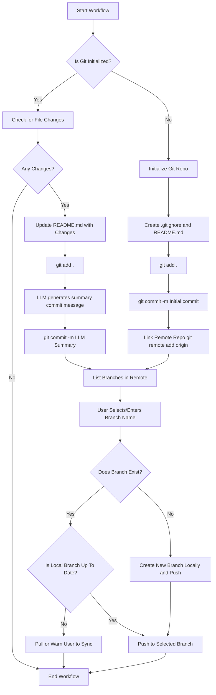

# Git Workflow Automation

This project automates a typical Git workflow using a combination of logic and user inputs. It is intended to streamline the process of setting up and maintaining a Git repository for your project.

---

## What It Does

- Checks if Git is initialized in the current directory.
- Accepts:
  - Repository URL
  - Username/password or authentication key
- If not initialized:
  - Scans through the directory
  - Creates a `.gitignore` and `README.md`
  - Adds all files not in `.gitignore`
  - Makes an initial commit with a user-defined theme message
- If already initialized and remote linked:
  - Checks for changes in the root directory
  - Updates `README.md` with details of recent changes
  - Stages and commits the changes with a summary message
- Before pushing:
  - Lists all branches from the remote repository
  - Lets user choose an existing branch or enter a new branch name
  - Pushes changes to that branch (if up to date)

---

## How It Works

The tool follows a decision-based flow to determine the state of the current directory and guide the Git operations. It prompts at appropriate steps and performs the operations automatically wherever possible.

---

## Initial Architecture diagram

---

## Notes

This project is still under development. Core functionality is being implemented step by step, starting from repository detection and basic commit automation.

